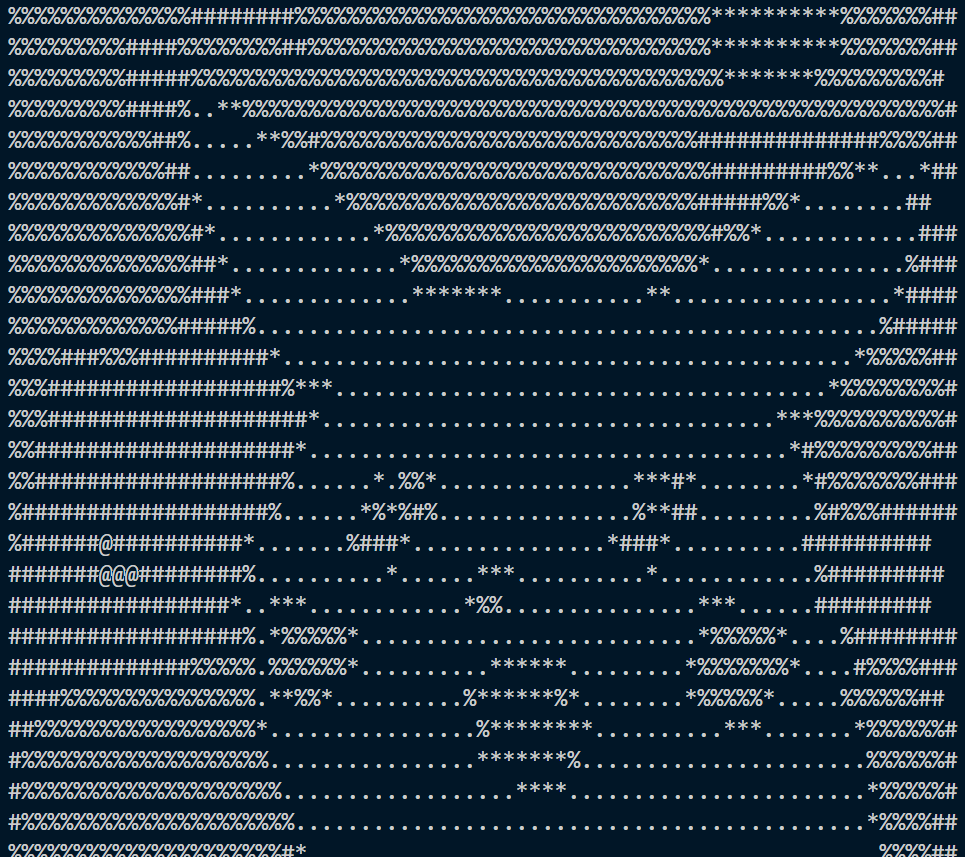
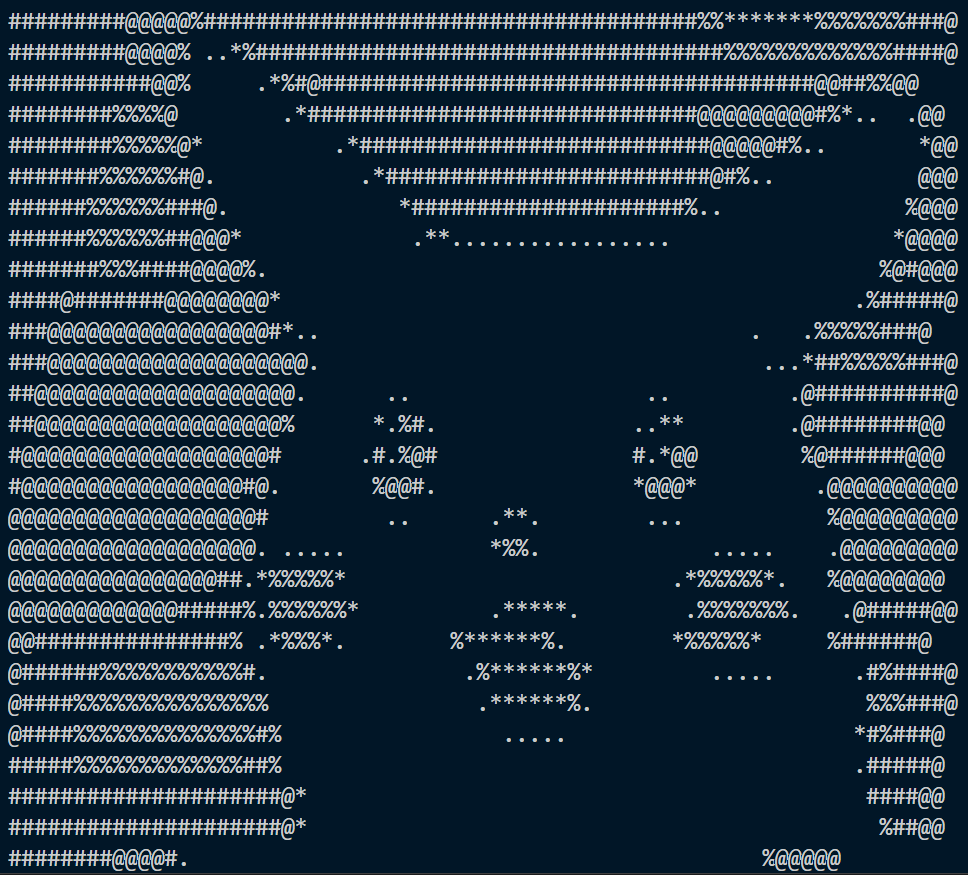
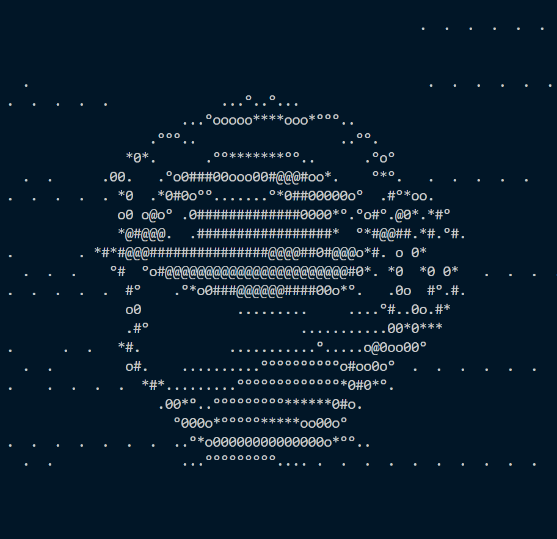

# 🖼️ Image to ASCII Converter (CLI) 

## 🚀 Features
- Converts images into ASCII art using customizable character sets of any size
- Adjustable **brightness** and **contrast**
- Option to **invert** image colors
- Written in **python**

## 🛠 How To Use 
Make sure you have **Python 3.6+** installed.

Install pillow using:
```bash
pip install pillow
```

Clone the repository using:
```bash
git clone https://github.com/Alexcs-hi/Image-To-ASCII.git
cd Image-To-ASCII-CONVERTOR
```

## 📌 Finally
Run the script by executing:
```bash
python ascii_generator.py
```
---

## 🌟 Example
### 🔹 **Before → After** 🔹

| Original Image | ASCII Art Output 
                 (Brigthness 100% , Contrast 100% inverted) |
|---------------|----------------|
|  |  |


| Original Image | ASCII Art Output 
                 (Brigthness 100% , Contrast **200%** inverted) |
|---------------|----------------|
|  |  |


| Original Image | ASCII Art Output 
                 (Brigthness 100% , Contrast 100% inverted) |
|---------------|----------------|
|  |  |

The coffee one is a bit distorted , but you can change the resizing of the image 
insisde the script get_image() function
---

## 📧 Contact
For questions or suggestions, reach out at **alexcs.hello@gmail.com** or via Discord: **alexcs_ye**.

## 🤝 Contributing
Contributions are welcome! Feel free to open an issue or a pull request if you have improvements or bug fixes.

## 📜 License
This project is licensed under the **MIT License**. Feel free to use, modify, and distribute!

---
## 👋 Cya ! 

